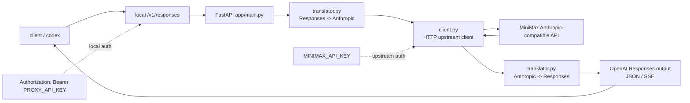

# any2response

[English](README.en.md) | [简体中文](README.md)

[](LICENSE)
[](#快速开始)
[](#协议支持范围)
[](#当前范围)
[](#架构)
[](#codex-接入)

`any2response` 是一个轻量级的本地代理服务，用于把上游模型 API 转换成 OpenAI Responses 协议。

当前实现重点覆盖一条最实用的链路：

- 输入：OpenAI Responses 风格请求
- 上游：MiniMax Anthropic 兼容 Messages API
- 输出：OpenAI Responses 兼容响应与流式事件

这样可以把 `codex` 等客户端统一接到本地 `/v1/responses` 端点上，同时把上游供应商差异隔离在代理层内。

## 项目摘要

- 项目名称：`any2response`
- 默认接口：`/v1/responses`
- 当前输入协议：OpenAI Responses
- 当前上游协议：MiniMax Anthropic-compatible Messages API
- 当前定位：面向 `codex` 和工具调用工作流的本地统一代理层
- 部署方式：本地运行或 `systemd --user` 常驻服务

## 为什么要用它

- 为下游集成统一 OpenAI Responses 接口
- 把不同供应商的请求和流式差异收敛到一个代理层
- 保持部署模型简单：一个本地 Python 服务，一个 HTTP 端点
- 为后续增加更多上游适配器保留扩展空间

## 当前范围

| 输入协议 | 状态 | 说明 |
| --- | --- | --- |
| OpenAI Responses | 已支持 | 当前主路径，转换后转发到 MiniMax Anthropic 兼容 API |
| OpenAI Chat Completions | 未实现 | 当前仓库暂不支持 |
| Anthropic Messages 作为输入 | 未实现 | 当前不是双向任意协议转换器 |

## 架构

```text
client / codex
    -> 本地 /v1/responses
    -> Python translator
    -> MiniMax Anthropic-compatible API
    -> Python translator
    -> OpenAI Responses output
```



主要组件：

- `app/main.py`：FastAPI 入口与 HTTP 接口
- `app/translator.py`：Responses <-> MiniMax/Anthropic 转换逻辑
- `app/client.py`：上游 HTTP 客户端
- `app/config.py`：环境变量配置
- `scripts/install_user_service.py`：安装 `systemd --user` 服务
- `scripts/install_codex_metadata.py`：安装本地 Codex 模型元数据

## 核心特性

- 将 Responses 请求转换为 MiniMax Anthropic 兼容消息格式
- 提供 Responses 风格的非流式与流式输出
- 支持函数工具与面向 Codex 的工具调用回放
- 支持内建 `apply_patch` 与 `shell` 调用转换
- 覆盖当前支持子集内的文本、图片、PDF 输入
- 使用独立本地代理 key 做访问认证
- 可选安装 `systemd --user` 服务，实现常驻运行

## 快速开始

### 克隆仓库

```bash
git clone https://github.com/ctyup879/any2response.git
cd any2response
```

### 安装

```bash
python3 -m venv .venv
.venv/bin/python -m pip install -r requirements.txt
cp .env.example .env
```

把 `.env` 改成你的真实配置：

```bash
MINIMAX_API_KEY=你的 MiniMax Key
PROXY_API_KEY=你的本地代理 Key
HOST=127.0.0.1
PORT=8765
UPSTREAM_BASE_URL=https://api.minimaxi.com/anthropic/v1/messages?beta=true
```

### 启动

```bash
./start_proxy.sh
```

默认监听地址：

```text
http://127.0.0.1:8765/v1/responses
```

## 作为用户服务运行

安装并启用 `systemd --user` 服务：

```bash
python3 scripts/install_user_service.py
systemctl --user daemon-reload
systemctl --user enable --now minimaxdemo-proxy.service
```

查看服务状态：

```bash
systemctl --user status minimaxdemo-proxy.service --no-pager
journalctl --user -u minimaxdemo-proxy.service -n 50 --no-pager
```

停止或禁用：

```bash
systemctl --user stop minimaxdemo-proxy.service
systemctl --user disable minimaxdemo-proxy.service
```

## 请求示例

```bash
curl http://127.0.0.1:8765/v1/responses \
  -H "Content-Type: application/json" \
  -H "Authorization: Bearer ${PROXY_API_KEY}" \
  -d '{
    "model": "codex-MiniMax-M2.7",
    "input": "hello",
    "stream": false
  }'
```

## Codex 接入

本仓库里的本地示例 profile 名称是 `m128py`。

先准备一个给 Codex 使用的环境变量。这个值应当与代理服务 `.env` 里的 `PROXY_API_KEY` 保持一致：

```bash
export MINIMAX_PROXY_API_KEY=your-local-proxy-key
```

然后在 `~/.codex/config.toml` 中加入 provider 和 profile：

```toml
[model_providers.minimax_py]
name = "MiniMax Python Responses Proxy"
base_url = "http://127.0.0.1:8765/v1"
env_key = "MINIMAX_PROXY_API_KEY"
wire_api = "responses"
requires_openai_auth = false
request_max_retries = 4
stream_max_retries = 10
stream_idle_timeout_ms = 300000

[profiles.m128py]
model = "codex-MiniMax-M2.7"
model_provider = "minimax_py"
```

先安装一次本地模型元数据：

```bash
python3 scripts/install_codex_metadata.py
```

把本地 Codex 配置指向本代理后，可以这样做冒烟测试：

```bash
codex exec --profile m128py "Reply with exactly OK and nothing else."
```

更多调用示例：

```bash
codex exec --profile m128py "hello"
codex exec --profile m128py "Read README.md, then reply with only the first heading including the leading #."
```

## 协议支持范围

这个项目并不是完整的 OpenAI Responses 协议等价实现。它实现的是 `codex` 及相关工具调用工作流所需的子集，并且会对不支持的字段做显式校验，避免静默改写请求。

当前已支持：

- 顶层字符串输入和 message-item 输入
- developer / system 指令折叠到上游 `system`
- function tools
- 带校验的 `tool_choice.allowed_tools`
- 命名 `custom`、`apply_patch`、`shell` 工具选择
- `function_call`、`custom_tool_call`、`apply_patch_call`、`shell_call`
- 对应的工具输出项
- 消息内嵌 `tool_use` 与 `tool_result`
- 文本输入
- `data:` URL 或 `http(s)` URL 图片输入
- 内联 text、JSON、image、PDF 文件输入
- 显式提供时的 `max_output_tokens`
- `temperature`
- `top_p`
- `stop`
- `text.format` 和旧版 `response_format`
- best-effort 的 `text.verbosity`
- `prompt_cache_key` 响应上下文保留
- 对 `parallel_tool_calls: false` 的代理侧约束
- `reasoning.effort`
- `reasoning.summary`
- 已废弃的 `reasoning.generate_summary`
- 文本流式增量
- reasoning 流式增量
- 工具参数流式增量
- 支持多行 `data:` 的 SSE 解析

当前明确不支持：

- `background`
- `store=true`
- `previous_response_id`
- 非 `disabled` 的 `truncation`
- `max_tool_calls`
- `item_reference`
- `conversation`
- `context_management`
- `prompt`
- `prompt_cache_retention`
- `safety_identifier`
- `service_tier`
- `input_file.file_id`
- `input_image.file_id`
- 非 `auto` 的 `input_image.detail`
- 远程文本文件抓取和大多数非文本/非图片/非 PDF 文件类型
- `file_search`、`web_search`、`computer_use`、`code_interpreter`、`mcp` 等 hosted / remote OpenAI tools
- 完整 OpenAI reasoning replay 语义
- 非空 `include`
- 所有 `top_logprobs`
- `syntax: "lark"` 的 custom tool grammar
- annotations / citations 一类响应增强字段

兼容性说明：

- assistant `phase` 目前是代理层 bridge，不是原样上游字段保留
- `commentary` 会映射成 Anthropic `thinking`
- `output_text` 只反映 assistant `final_answer` 文本
- function tools 的 `strict=false` 为 Codex 兼容而接受，但不会被上游强制执行
- 非法请求形状会在本地直接拒绝，而不是静默规范化

## 安全说明

- `.env` 已被 git 忽略，不应提交
- `last_request.json` 已被 git 忽略，可能包含本地调试请求内容
- 建议把本地敏感文件权限收紧为 `chmod 600 .env last_request.json`
- 如果真实 key 曾经出现在忽略文件之外，公开发布前应先轮换
- 推送到公开仓库前请检查 git 作者身份

## 开发

运行测试：

```bash
.venv/bin/pytest -q
```

## 仓库地址

- GitHub: <https://github.com/ctyup879/any2response>

## 开源协议

本项目采用 MIT License，详见 [LICENSE](LICENSE)。
